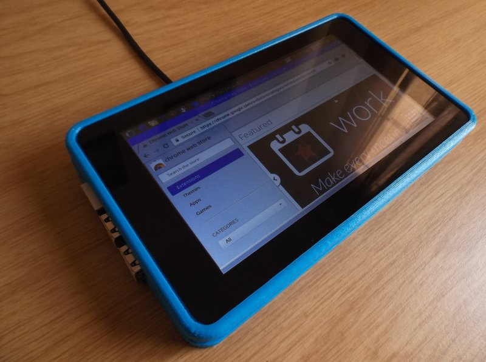
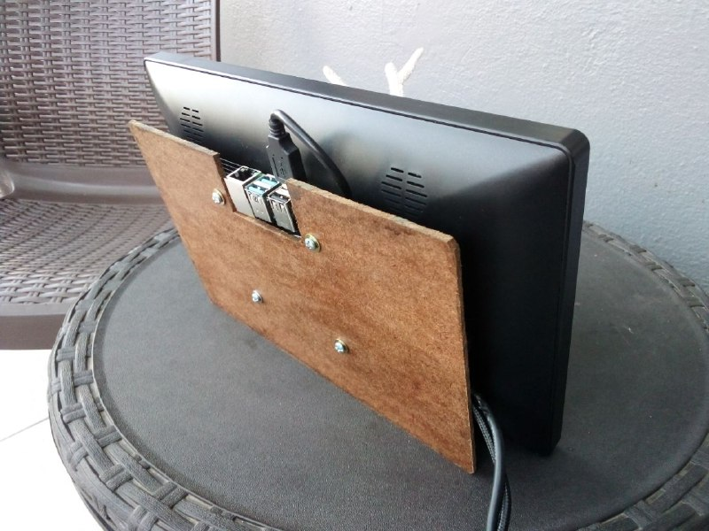
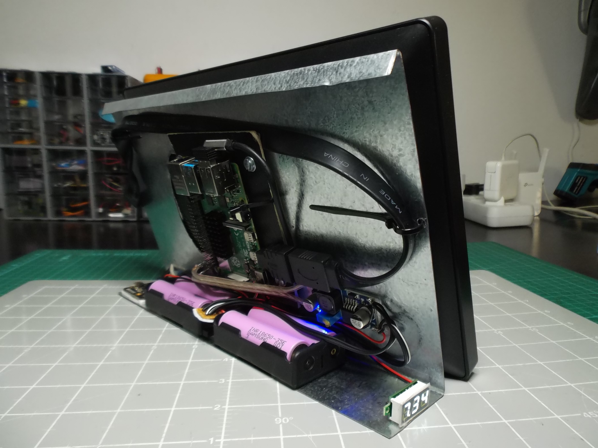

# RPi Tablet OS

Customization of Raspberry Pi OS for DIY Raspberry Pi based tablets. This is a work-in-progress.

View a video of a [7" Raspberry Pi tablet](https://tobykurien.com/images/rpi_tab/rpi-tab.mp4), and an [11.6" Raspberry Pi tablet](https://tobykurien.com/images/rpi_tab/rpi-tab-10.mp4). You can also read the [blog post](https://tobykurien.com/rpi_tab/) detailing some of the features.

# 7" Raspberry Pi tablet

To build the 7" Raspberry Pi tablet, you will need:

- **Raspberry Pi**: minimum 3b, recommend 4b with 4Gb of RAM. I do not recommend sticking a heatsink on, as over time it will slide off the chip. Active cooling is not necessary if you don't overclock the Pi, and since the Pi will be in a vertical position during use, it [will run cool](https://www.raspberrypi.org/blog/thermal-testing-raspberry-pi-4/).
- **USB Cable**: for powering the Pi. The cable selection is important - a cheap cable may not carry enough current, and you will see the "yellow lightning bolt" on the Pi indicating power throttling. I recommend a 3A capable braided cable, as the cable will take strain during normal use, since it is permanently connected to the tablet.
- **microSD card**: for your OS and storage. I used a plain Sandisk 16Gb class 10 card.
- **Official Raspberry Pi touchscreen**: if you have the original v1.0 like I do, then the screen brightness cannot be controlled by software, and you may want to consider modifying the LCD controller board with a potentiometer and MOSFET current limiter like I did (details to come).
- **3D-printed case** from [Thingiverse](https://www.thingiverse.com/thing:1068762): this is the one I used, however I did not print the rear cover, instead I opted for a clear polycarbonate sheet that I cut to size and screwed into place. The clear polycarbonate allows me to see the activity and power LEDS of the Pi, and also looks great when showing off the tablet to others, as you can see the innards. I also cut a slot into the rear panel to allow me to remove and insert the microSD card.
- **Powerbank**: A high quality powerbank capable of at least 2.1A or more. A 10,000mAh powerbank provides adequate battery life (over 10 hours). You want a powerbank with a built-in display that shows how much charge is left, since the tablet won't be showing you that.
- (Optional) [microSD slot extender](https://www.amazon.com/sd-card-extension/s?k=sd+card+extension): will allow you to mount a microSD slot into the side of the case for easy card access.
- Bolts/screws/grubs, drill, and screwdriver to put everything together

The Pi is mounted onto the back of the LCD in an inverted and offset way. It will require that you gently bend the Ground and 5V pins on the Pi GPIO outwards a little so that the jumpers from the LCD driver board can connect while still allowing the Pi to lie flat against the back of the LCD. The assembled unit is shown in this video:

[VIDEO: 7" Raspberry Pi tablet](https://tobykurien.com/images/rpi_tab/rpi-tab.mp4)

# 11.6" full-HD Pi tablet

To build the 11.6" Raspberry Pi tablet, you will need:

- **Raspberry Pi**: recommend 4b with 4Gb of RAM. As stated above, a heatsink isn't necessary provided you do not overclock the Pi.
- **USB cable**: to power the Pi. Same notes as above apply (high quality, at least 3A capable, braided).
- **microSD card**: for your OS and storage. I used a plain Sandisk 16Gb class 10 card.
- [11.6" touch screen](https://www.waveshare.com/11.6inch-hdmi-lcd-h-with-case.htm): which I bought [here](https://www.robotics.org.za/W16642). When selecting a screen for your build, you should consider the placement of the HDMI, power, and USB ports on the screen. If they are placed along the edge, you will have big cables and connectors on the side of your tablet, making it difficult to carry and use. Another factor is whether or not the screen has built-in brightness control and an on/off switch - these will make it more practical. Finally, having built-in speakers also helps a lot.
- **Boost converter**: to convert the 5V from the powerbank to 12V for the LCD. I used [this one](https://www.robotics.org.za/MT3608). The screen can draw up to 20W on maximum brightness with loud audio playback, so your boost converter should be able to handle 2A or more.
- **Power barrel connector**: the thin barrel connector for the LCD. I used the original one that came with the LCD by cutting it off the included power supply.
- Sacrificial **USB cable**: a USB cable of equal length to the one you will use for the Pi, but the connector will be cut off so that you can solder the cable into the boost coverter (red wire to positive, black wire to negative), which will then be connected to the power connector for the LCD. I used a cable that has a [ferrite bead](https://en.wikipedia.org/wiki/Ferrite_bead) on one end of the cable, which I think is important, because the various switching power supplies in the tablet and the powerbank can interfere and resonate, causing damage (I lost a powerbank this way). I twisted the two USB cables (one for the Pi and another for the LCD screen) together to make it feel like a single cable, which makes it easier to manage.
- **Powerbank**: A high quality powerbank with a battery level display, capable of at least 3A or more, with two USB outputs (or two separate powerbanks). This tablet can draw lots of power (over 20W if maxed out on brightness, audio, and computation). I prefer to use two separate powerbanks so that I get better battery life, avoid any potential resonance issues with the switching power supplies, and each powerbank can reliably power the tablet.
- Bolts/screws/double-sided tape, soldering iron to solder the boost converter on, and I used a thin sheet of MDF wood that I cut, varnished, and screwed over the back of the tablet. Unfortunately this makes the screen's controls inaccessible.

This is an easier build than the 7" tablet above, although the tablet is not as portable, and it is harder to power. I did try various options, like powering from 12V through one cable, using a LiPo pack, etc., however the powerbank still offers better portability and practicality. The gorgeous screen makes it worth it though. The build is described in this video:

[VIDEO: 11.6" Raspberry Pi tablet](https://tobykurien.com/images/rpi_tab/rpi-tab-10.mp4)

# 11.6" full-HD Pi Portable PC

This is a more advanced version of the above tablet with the following features:

- Metal backing plate to act as a stand, hold an integrated battery pack, and has a lip at the top allowing the tablet/PC to be easily carried around
- Relatively stable on the lap and on a desk thanks to low center of gravity provided by battery pack placement, making it useable as both a tablet and a PC

# RPi Tablet OS

You can install any OS you like on your Raspberry Pi tablet, with Raspberry Pi OS and Ubuntu MATE providing decent support for the touch screen out-of-the-box. However, you will start running into usability issues, for example, how do I type text, minimize/maximize, switch between apps, get out of full screen, etc. with no keyboard or mouse attached? The scripts below are meant to solve many of these problems, specifically for Raspberry Pi OS.

## Installation

After installing Raspberry Pi OS, run the following command in a terminal:

`curl "https://raw.githubusercontent.com/tobykurien/rpi_tablet_os/master/install.sh" | /bin/sh`

Please only run this on a fresh installation of the latest Raspberry Pi OS (or make a backup of your existing installation first), as the script makes many assumptions that may delete data from an already-customized installation. It is safe to run this script multiple times.

## Usage

Once installed, you can use the following touch gestures:

- **Two-finger tap** to right-click. Whichever finger touched first becomes the point that it right-clicked. You can also long-press for a right-click, but there are instances where that might not work.
- **Three-finger swipe** up or down to maximize or minimize the current window
- **Three-finger tap** to fullscreen or un-fullscreen the current window
- **Three-finger swipe** left or right to switch between browser tabs (Ctrl-Tab)
- **Three-finger pinch** Close the current app/window
- **Four-finger swipe** left or right to switch between apps (Alt-Tab)

The above gestures can be changed in `~/.config/touchegg/touchegg.conf`

If you would like to install the latest Firefox (rather than the old ESR version), you can execute the `firefox_install.sh` script from the home directory. You will need to run this script regularly to keep Firefox updated.

## What the script does

- Installs and configures OnBoard on-screen keyboard
- Installs and configures touchegg for touch gestures
- Makes bluetooth audio streaming work
- Enables hardware acceleration for Chromium as described in [this article](https://www.dedoimedo.com/computers/rpi4-ubuntu-mate-hw-video-acceleration.html)

## Other tweaks and tips

- [Enable Netflix](https://www.tomshardware.com/how-to/play-netflix-raspberry-pi) and other DRM-enabled streaming services
- For fast power-off, run `sync` command in a terminal, and once it completes, you can disconnect power safely.
- For screen-saving, you can install `xscreensaver` and configure it to turn off the screen rather than just showing a blank screen (to save power). However my experience has been that it sometimes activates during boot-up and touch stops working, leaving you stuck with no option but to reboot. I don't recommend it.
